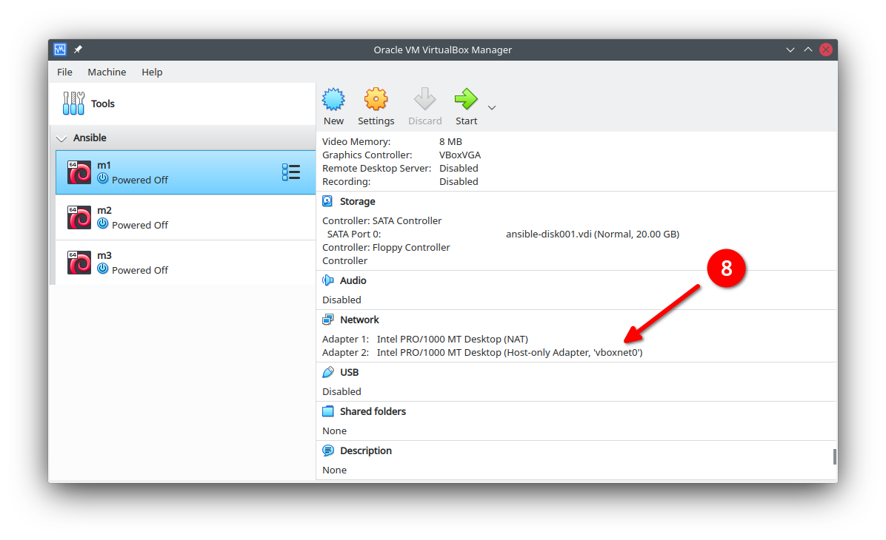

# VirtualBox

Será preciso instalar o [VirtualBox](https://www.virtualbox.org/) de alguma forma. 

O pacote com as máquinas virtuais pode ser baixado em https://storage.googleapis.com/live-ansible/ansible.ova, a **ova** pode não estar disponível após o evento.

Ao baixar o arquivo `.ova` será preciso importá-lo e adicionar uma interface de rede para a comunicação com as máquinas.

## Preparação

Clique no ícone para **importar** o pacote.

Na janela que aparecerá, selecione o ícone do **diretório**.

Selecione o arquivo `ansible.ova` e confirme a escolha.

Clique no botão para **avançar**.

Uma descrição das máquinas aparecerá, são três no total, simplesmente confirme clicando no botão **importar**.

Aceite as licensas... ops, isso foi erro meu ao gerar as máquinas...

Veja que a máquina pede por uma interface de rede que ainda não existe, ou se existe precisará ser modificada.

- No menu superior clique em `Arquivo -> Gerenciador de Redes`.
- Crie uma nova interface de rede clicando em **Criar**, o nome não importa.
- No campo `Endereço IPv4` digite `172.27.11.1`.
- Clique em aplicar e confirme se as modificações foram aceitas, as vezes o VirtualBox ignora.

[Passo 9](images/vb-import-09.png)

Modifique a **segunda** interface de rede da máquina clicando em seu nome.

[Passo 10](images/vb-import-10.png)

Selecione a interface de rede que acabou de criar e clique em **OK**.

[Passo 11](images/vb-import-11.png)

Agora é possível iniciar esta máquina e utilizar a própria interface do VirtualBox ou utilizar algum software externo como [putty](https://www.chiark.greenend.org.uk/~sgtatham/putty/latest.html) ou [git bash](https://gitforwindows.org/) para acessá-la.

Modifique as outras máquinas para utilizar a mesma interface criada, não será necessário criar outra.
